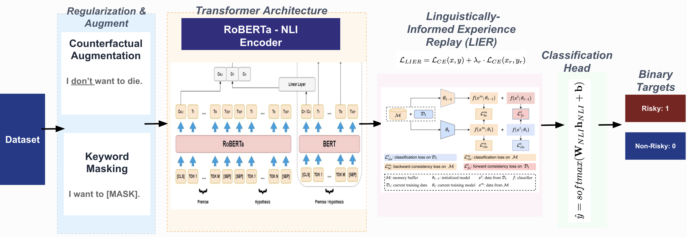

# Disambiguating Suicidal Intent: Mitigating Shortcut Learning and Catastrophic Forgetting via LIER

Final Project for COSE461 — Natural Language Processing  
[cite_start]Korea University [cite: 2]

## Team Members
* [cite_start]Mahirah Sofea (2023320033) [cite: 3, 6]
* [cite_start]Nadiah Nabilah (2023320093) [cite: 7, 8]
* [cite_start]Julia Irsalina (2023320344) [cite: 9, 11]
* [cite_start]Emira Syazwani (2023320334) [cite: 12, 14]

---

# Project Overview

[cite_start]This project investigates **shortcut learning** and **catastrophic forgetting** in risky versus non-risky intent classification for crisis NLP systems[cite: 17]. 

[cite_start]Modern language models often achieve near-perfect in-distribution accuracy through brittle pattern matching while failing to correctly interpret context-dependent, ambiguous expressions such as[cite: 18]:
* “I don’t want to die.” (Negation) [cite_start][cite: 33]
* “I want to die of laughter.” (Figurative language) [cite_start][cite: 31]
* “I won’t cut myself.” (Negation) [cite_start][cite: 167]

[cite_start]These examples contain high-risk keywords but express completely benign intent[cite: 16]. [cite_start]Our work uses SHAP and Monte Carlo (MC) Dropout to show that baseline fine-tuned models rely on isolated keywords rather than genuine contextual understanding[cite: 19, 22]. [cite_start]To resolve this, we propose **Linguistically-Informed Experience Replay (LIER)**—a lightweight continual learning framework that preserves linguistic abilities and bridges the ID-OOD performance gap[cite: 20].

---

# Pipeline Architecture

Below is the complete methodology pipeline implemented in this project:

[cite_start]The workflow consists of preprocessing dataset splits via shortcut mitigation techniques, passing text embeddings through an NLI-initialized encoder backbone, combining the primary cross-entropy objective with a linguistically structured synthetic replay buffer, and routing prediction outputs to binary target classes[cite: 77, 78].

---

# Main Objectives

* [cite_start]**Expose Shortcut Learning:** Use SHAP (SHapley Additive exPlanations) to capture token-level contributions and map spurious model dependencies[cite: 113, 117].
* [cite_start]**Quantify Catastrophic Forgetting:** Evaluate how standard task-specific fine-tuning degrades a pre-trained model's generic semantic reasoning capabilities[cite: 46, 89].
* [cite_start]**Robustness under Distribution Shift:** Evaluate performance under out-of-distribution (OOD) scenarios using a dataset curated specifically to exclude trivial direct-intent cues[cite: 18, 126].
* [cite_start]**Implement Continual Mitigation Frameworks:** Develop and evaluate Keyword Masking (KM), Counterfactual Augmentation (CA), and a novel structured rehearsal strategy (LIER)[cite: 20].
* [cite_start]**Uncertainty Calibration:** Employ Monte Carlo (MC) Dropout at inference to expose confidently wrong model misclassifications[cite: 22, 99].

---

# Dataset

[cite_start]We constructed two custom benchmarks for ambiguous risky-intent classification focusing on 20 distinct risk-related keywords (e.g., `die`, `kill`, `cut`, `jump`) spanning multiple semantic context groups[cite: 17, 93].

### 1. In-Distribution (ID) Dataset
[cite_start]Contains 3,120 examples evenly balanced across risky and non-risky classes, spread symmetrically over six linguistic categories: *direct, figurative, negation, temporal, negation-temporal, and ambiguous*[cite: 122].

| Split | Examples | Non-risky | Risky |
| :--- | :--- | :--- | :--- |
| **Train** | 2,184 | 1,092 | 1,092 |
| **Validation** | 468 | 233 | 235 |
| **Test** | 468 | 235 | 233 |

[cite_start]*Path:* `data/raw/datasetnad_latest_4.0.csv` [cite: 128]

### 2. Out-of-Distribution (OOD) Dataset
[cite_start]A held-out dataset of 150 examples (80 non-risky, 70 risky) specifically designed for shortcut evaluation[cite: 125]. [cite_start]Unlike the ID split, **it completely excludes direct-intent examples**, isolating the model's capacity to interpret negation, temporal shifts, and figurative expressions under distribution shift[cite: 126].

[cite_start]*Path:* `data/raw/custom_ood_set_150_julia.csv` [cite: 125]

---

# Detailed Methodology & Mathematical Formulations

### 1. Task Formulation
[cite_start]We formulate ambiguous suicidal intent detection as a binary sequence classification task[cite: 53, 139]. [cite_start]Given an input sentence $x$ containing an ambiguous risk keyword $k \in K$, the model predicts a target label $y \in \{0, 1\}$, where $0$ denotes non-risky intent and $1$ denotes risky intent[cite: 53].

### 2. Baseline Model Optimization (RoBERTa & NLI-RoBERTa Fine-Tuning)
[cite_start]For standard fine-tuning, the pooled representation vector $h \in \mathbb{R}^{768}$ corresponding to the `[CLS]` token is passed to a linear classification head[cite: 56, 88]:

$$\hat{y} = \text{softmax}(Wh + b)$$

[cite_start]The standard fine-tuning configuration yields predictions $\hat{y}$ (or $\tilde{y}$ for the NLI backbone) optimized via Cross-Entropy (CE) loss over binary targets[cite: 57, 87, 141]:

$$\mathcal{L}_{CE} = -\sum_{c \in \{0,1\}} y_{c} \log \hat{p}_{c}$$

[cite_start]where $y_c$ is the true binary label and $\hat{p}_c$ represents the model's predicted probability for class $c$[cite: 142].

### 3. NLI-RoBERTa Zero-Shot Classification
[cite_start]To capture contextual semantic priors without training, the model scores candidate hypotheses $h_y \in \{\text{"This sentence expresses risky intent"}, \text{"This sentence expresses non-risky intent"}\}$ against the input premise $x$[cite: 81]:

$$p(y|x) = \frac{\exp(\text{NLI}(x, h_{y}))}{\sum_{y^{\prime} \in \mathcal{Y}} \exp(\text{NLI}(x, h_{y^{\prime}}))}$$

[cite_start]where $\text{NLI}(x, h_y)$ represents the raw logit score for semantic entailment generated by the cross-encoder backbone[cite: 84].

### 4. Shortcut Learning Mitigation Techniques
* [cite_start]**Keyword Masking (KM):** To penalize keyword-to-label mapping shortcuts, target trigger words are randomly replaced by the generic token `[MASK]` at training time, forcing the model to depend heavily on the semantic layout of the surrounding context tokens[cite: 93].
* [cite_start]**Counterfactual Augmentation (CA):** Minimizes keyword correlation artifacts by pairing lookalike sentences using identical core trigger words inside contrasting target labels (*e.g., "I want to die tonight" [$y=1$] vs. "I want to die of laughter" [$y=0$]*)[cite: 95].

### 5. Linguistically-Informed Experience Replay (LIER)
[cite_start]To actively combat catastrophic forgetting under fine-tuning, our proposed framework incorporates a continual learning strategy using a structured synthetic buffer $\mathcal{B}$[cite: 105]. [cite_start]Unlike standard unconstrained data rehearsal, $\mathcal{B}$ is systematically categorized across 5 distinct language structures[cite: 106]:
$$\mathcal{C} = \{\text{negation, figurative, temporal, negation + temporal, ambiguous}\}$$

[cite_start]The network optimizes training runs via a combined objective function[cite: 108]:

$$\mathcal{L}_{LIER} = \mathcal{L}_{CE}(x, y) + \lambda_{r} \cdot \mathcal{L}_{CE}(x_{r}, y_{r}), \quad (x_{r}, y_{r}) \sim \mathcal{B}$$

[cite_start]where $\lambda_r = 0.3$ acts as a penalty weight balancing the main dataset distribution with rehearsal streams drawn from the targeted synthetic replay buffer[cite: 108, 110].

### 6. Explainability Diagnostics via SHAP
[cite_start]To analytically verify whether classifications stem from superficial keywords or context patterns, we track token-level attributions using Shapley values[cite: 113, 117]. [cite_start]The feature contribution value $\phi_i$ for an individual token $i$ across a feature set $F$ is calculated via[cite: 114, 116]:

$$\phi_{i} = \sum_{S \subseteq F \setminus \{i\}} \frac{|S|!(|F| - |S| - 1)!}{|F|!} \left[ f(S \cup \{i\}) - f(S) \right]$$

### 7. Uncertainty Estimation via Monte Carlo (MC) Dropout
[cite_start]To detect shortcut-driven errors at inference, we pass input texts through $T = 30$ stochastic forward executions while keeping dropout active[cite: 99, 217]. [cite_start]The predictive variance over probabilities $\hat{p}_t$ acts as a formal measure of uncertainty[cite: 100, 101]:

$$\text{Var}[\hat{y}] = \frac{1}{T} \sum_{t=1}^{T} \hat{p}_{t}^{2} - \left( \frac{1}{T} \sum_{t=1}^{T} \hat{p}_{t} \right)^{2}$$

---

# Key Experimental Results

[cite_start]Models are evaluated below based on In-Distribution (ID) vs Out-of-Distribution (OOD) metrics and ranked by OOD Macro-F1[cite: 146]:

| Experiment | Configuration | ID Acc | ID Macro-F1 | OOD Acc | OOD Macro-F1 | Confident Wrong |
| :--- | :--- | :--- | :--- | :--- | :--- | :--- |
| **E17** | **NLI-RoBERTa + LIER + KM + CA** | **1.0000** | **1.0000** | **0.7533** | **0.7531** | **37** |
| **E12** | NLI-RoBERTa + KM + CA | 0.9957 | 0.9957 | 0.7000 | 0.6951 | 45 |
| **E16** | NLI-RoBERTa + LIER | 1.0000 | 1.0000 | 0.6867 | 0.6843 | 47 |
| **E11** | NLI-RoBERTa + CA | 1.0000 | 1.0000 | 0.6800 | 0.6791 | 47 |
| **E4** | RoBERTa + KM + CA | 1.0000 | 1.0000 | 0.6933 | 0.6767 | 45 |
| **E5** | RoBERTa + LIER | 1.0000 | 1.0000 | 0.6867 | 0.6707 | 45 |
| **E6** | RoBERTa + LIER + KM + CA | 1.0000 | 1.0000 | 0.6733 | 0.6470 | 46 |
| **E3** | RoBERTa + CA | 1.0000 | 1.0000 | 0.6667 | 0.6438 | 46 |
| **E8** | NLI-RoBERTa Zero-Shot | 0.7051 | 0.6788 | 0.6133 | 0.5837 | **5** |
| **E9** | NLI-RoBERTa Fine-Tuned | 1.0000 | 1.0000 | 0.5267 | 0.4884 | 69 |
| **E1** | RoBERTa Fine-Tuned (Baseline) | 0.9979 | 0.9979 | 0.5267 | 0.4531 | 67 |
| **E10** | NLI-RoBERTa + KM | 1.0000 | 1.0000 | 0.5067 | 0.4127 | 71 |
| **E2** | RoBERTa + KM | 1.0000 | 1.0000 | 0.4933 | 0.3806 | 74 |
| **E0** | RoBERTa (Pure Baseline) | 0.4979 | 0.3324 | 0.4667 | 0.3182 | 0 |

### Key Takeaways
* [cite_start]**Misleading High ID Accuracy:** Standard fine-tuned baselines (**E1**, **E9**) achieve near-perfect ID accuracy but collapse on OOD testing, revealing high dependence on shortcut correlations[cite: 149, 154].
* [cite_start]**Catastrophic Forgetting Exposed:** Direct fine-tuning on NLI backbones (**E9**) completely strips the model's pre-trained negation awareness, dropping OOD performance significantly compared to its zero-shot baseline (**E8**)[cite: 154, 155].
* [cite_start]**The Power of LIER:** Combining NLI linguistic priors with the LIER rehearsal strategy and context mitigations (**E17**) achieves an OOD macro-F1 of **0.7531**, outperforming the baseline by **30 percentage points** and significantly reducing confident misclassifications[cite: 147].