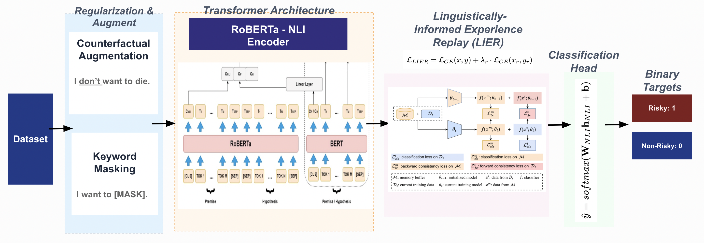

# Disambiguating Suicidal Intent

## Mitigating Shortcut Learning and Catastrophic Forgetting via LIER

Final Project for **COSE461 — Natural Language Processing**  
Korea University

## Team Members

- Mahirah Sofea (2023320033)
- Nadiah Nabilah (2023320093)
- Julia Irsalina (2023320344)
- Emira Syazwani (2023320334)

---

## Project Overview

This project investigates **shortcut learning** and **catastrophic forgetting** in risky versus non-risky intent classification for crisis NLP systems.

Modern language models can achieve near-perfect in-distribution accuracy by relying on brittle keyword patterns, while still failing to understand context-dependent and ambiguous expressions such as:

- “I don’t want to die.” — Negation
- “I want to die of laughter.” — Figurative language
- “I won’t cut myself.” — Negation

Although these examples contain high-risk keywords, they express benign or non-risky intent. This project uses **SHAP** and **Monte Carlo (MC) Dropout** to show that baseline fine-tuned models often rely on isolated keywords instead of contextual meaning.

To address this issue, we propose **Linguistically-Informed Experience Replay (LIER)**, a lightweight continual learning framework designed to preserve linguistic reasoning ability and improve robustness under out-of-distribution evaluation.

---

## Pipeline Architecture



The final pipeline combines:

1. Dataset preprocessing
2. Keyword Masking (KM)
3. Counterfactual Augmentation (CA)
4. NLI-RoBERTa backbone
5. Linguistically-Informed Experience Replay (LIER)
6. Binary risky / non-risky intent classification
7. SHAP and MC Dropout analysis

---

## Main Objectives

- **Expose shortcut learning** using SHAP token-level explanations.
- **Measure catastrophic forgetting** after task-specific fine-tuning.
- **Evaluate ID-OOD generalization** using both in-distribution and out-of-distribution test sets.
- **Improve robustness** using Keyword Masking, Counterfactual Augmentation, and LIER.
- **Analyze uncertainty** using MC Dropout to identify confidently wrong predictions.

---

## Dataset

The project uses two custom benchmarks for ambiguous risky-intent classification. The datasets focus on 20 risk-related keywords such as `die`, `kill`, `cut`, and `jump`, across multiple linguistic contexts.

### 1. In-Distribution (ID) Dataset

The ID dataset contains 3,120 balanced examples across risky and non-risky classes. It includes six linguistic categories:

- Direct
- Figurative
- Negation
- Temporal
- Negation-temporal
- Ambiguous

| Split | Examples | Non-risky | Risky |
| :--- | ---: | ---: | ---: |
| Train | 2,184 | 1,092 | 1,092 |
| Validation | 468 | 233 | 235 |
| Test | 468 | 235 | 233 |

**Path:** `data/raw/datasetnad_latest_4.0.csv`

### 2. Out-of-Distribution (OOD) Dataset

The OOD dataset contains 150 examples: 80 non-risky and 70 risky. It is designed for shortcut evaluation and excludes direct-intent examples. This allows the evaluation to focus on negation, temporal shifts, figurative language, and ambiguous expressions.

**Path:** `data/raw/custom_ood_set_150_julia.csv`

---

## Methodology

### 1. Task Formulation

The task is formulated as binary sequence classification. Given an input sentence `x` containing an ambiguous risk keyword `k`, the model predicts:

- `0` = non-risky intent
- `1` = risky intent

### 2. RoBERTa and NLI-RoBERTa Fine-Tuning

For standard fine-tuning, the pooled representation vector is passed into a linear classification head:

```math
\hat{y} = \text{softmax}(Wh + b)
```

The model is optimized using cross-entropy loss:

```math
\mathcal{L}_{CE} = -\sum_{c \in \{0,1\}} y_c \log \hat{p}_c
```

### 3. NLI-RoBERTa Zero-Shot Classification

For zero-shot evaluation, the NLI model compares the input sentence against two candidate hypotheses:

- “This sentence expresses risky intent.”
- “This sentence expresses non-risky intent.”

The final label is selected based on the entailment score:

```math
p(y|x) = \frac{\exp(\text{NLI}(x, h_y))}{\sum_{y' \in \mathcal{Y}} \exp(\text{NLI}(x, h_{y'}))}
```

### 4. Shortcut Learning Mitigation

#### Keyword Masking (KM)

Keyword Masking randomly replaces risky trigger words with `[MASK]` during training. This prevents the model from relying only on shortcut keywords and encourages it to use surrounding context.

Example:

```text
Original: I don't want to die.
Masked:   I don't want to [MASK].
```

#### Counterfactual Augmentation (CA)

Counterfactual Augmentation pairs similar sentences that share the same risk keyword but have different labels.

Example:

```text
Risky:     I want to die tonight.
Non-risky: I want to die of laughter.
```

This reduces keyword-label correlation and teaches the model to distinguish intent from context.

### 5. Linguistically-Informed Experience Replay (LIER)

LIER is a structured rehearsal strategy designed to reduce catastrophic forgetting during fine-tuning. Instead of replaying random examples, LIER uses a synthetic replay buffer organized by linguistic categories:

```math
\mathcal{C} = \{\text{negation, figurative, temporal, negation + temporal, ambiguous}\}
```

The model is trained with a combined objective:

```math
\mathcal{L}_{LIER} = \mathcal{L}_{CE}(x, y) + \lambda_r \cdot \mathcal{L}_{CE}(x_r, y_r), \quad (x_r, y_r) \sim \mathcal{B}
```

where `λr = 0.3` balances the main training loss with replay-buffer loss.

### 6. SHAP Explainability Analysis

SHAP is used to inspect token-level model behavior. It helps identify whether the model prediction is driven by meaningful context or by shortcut keywords.

```math
\phi_i = \sum_{S \subseteq F \setminus \{i\}} \frac{|S|!(|F| - |S| - 1)!}{|F|!} \left[ f(S \cup \{i\}) - f(S) \right]
```

### 7. Monte Carlo Dropout

MC Dropout is used during inference to estimate model uncertainty. The same input is passed through the model multiple times with dropout enabled.

```math
\text{Var}[\hat{y}] = \frac{1}{T} \sum_{t=1}^{T} \hat{p}_t^2 - \left( \frac{1}{T} \sum_{t=1}^{T} \hat{p}_t \right)^2
```

In this project, `T = 30` stochastic forward passes are used.

---

## Experimental Results

Models are evaluated using ID and OOD performance. The table is ranked by OOD Macro-F1.

| Experiment | Configuration | ID Acc | ID Macro-F1 | OOD Acc | OOD Macro-F1 | Confident Wrong |
| :--- | :--- | ---: | ---: | ---: | ---: | ---: |
| **E17** | **NLI-RoBERTa + LIER + KM + CA** | **1.0000** | **1.0000** | **0.7533** | **0.7531** | **37** |
| E12 | NLI-RoBERTa + KM + CA | 0.9957 | 0.9957 | 0.7000 | 0.6951 | 45 |
| E16 | NLI-RoBERTa + LIER | 1.0000 | 1.0000 | 0.6867 | 0.6843 | 47 |
| E11 | NLI-RoBERTa + CA | 1.0000 | 1.0000 | 0.6800 | 0.6791 | 47 |
| E4 | RoBERTa + KM + CA | 1.0000 | 1.0000 | 0.6933 | 0.6767 | 45 |
| E5 | RoBERTa + LIER | 1.0000 | 1.0000 | 0.6867 | 0.6707 | 45 |
| E6 | RoBERTa + LIER + KM + CA | 1.0000 | 1.0000 | 0.6733 | 0.6470 | 46 |
| E3 | RoBERTa + CA | 1.0000 | 1.0000 | 0.6667 | 0.6438 | 46 |
| E8 | NLI-RoBERTa Zero-Shot | 0.7051 | 0.6788 | 0.6133 | 0.5837 | **5** |
| E9 | NLI-RoBERTa Fine-Tuned | 1.0000 | 1.0000 | 0.5267 | 0.4884 | 69 |
| E1 | RoBERTa Fine-Tuned Baseline | 0.9979 | 0.9979 | 0.5267 | 0.4531 | 67 |
| E10 | NLI-RoBERTa + KM | 1.0000 | 1.0000 | 0.5067 | 0.4127 | 71 |
| E2 | RoBERTa + KM | 1.0000 | 1.0000 | 0.4933 | 0.3806 | 74 |
| E0 | RoBERTa Pure Baseline | 0.4979 | 0.3324 | 0.4667 | 0.3182 | 0 |

---

## Key Findings

- **High ID accuracy is misleading.** Fine-tuned baselines such as E1 and E9 achieve near-perfect ID scores but perform poorly on OOD data.
- **Shortcut learning causes OOD failure.** Models often rely on high-risk keywords instead of sentence-level meaning.
- **Fine-tuning can cause catastrophic forgetting.** NLI-RoBERTa fine-tuning reduces the model's original semantic reasoning ability compared to zero-shot NLI-RoBERTa.
- **LIER improves robustness.** The final model, E17, achieves the best OOD Macro-F1 score of **0.7531**.
- **MC Dropout reveals confidently wrong predictions.** Some models remain highly confident even when making incorrect OOD predictions.

---

## Final Model

The best-performing model is:

```text
NLI-RoBERTa + LIER + Keyword Masking + Counterfactual Augmentation
```

This model combines semantic priors from NLI-RoBERTa with shortcut mitigation and structured replay. It achieves the strongest OOD generalization while reducing confident wrong predictions compared to standard fine-tuned baselines.
